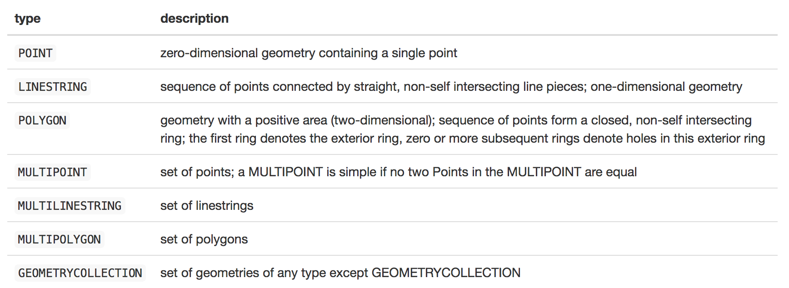

# 1. INTRODUCTION

## 1.1 Lesson Objectives

-   Discuss the importance of location in environmental data analysis
-   Examine how spatial features are represented: vector (vs raster) data model
-   Quick Maps: Plotting coordinate data using `ggplot`, `mapview` and `leaflet`
-   Examine how spatial features are stored in R: "Simple Features" and the `sf` package
-   Review coordinate reference systems (CRS) and discuss their importance
-   Examine a simple spatial analysis using the `sf` package

## 1.2 Discussion: The importance of location in environmental data analysis

We've spent time exploring how to wrangle data tables to reveal new information. An important step forward came when we joined two datasets on a common attribute (e.g. joining physical and nutrient attribute tables for LTER lakes), which allowed us to examine relationships across these two sources.

With GIS and spatial analysis, we don't necessarily need a common attribute to join tables from different sources; instead, we can use location. Thus, if we know the location of our NTL-LTER lakes, we can compute their distances from the EPA air quality monitoring locations to explore possible relationships between the two data sets. Thus, location is quite a powerful ally in environmental data analysis.

In this lesson, we explore how data can be represented spatially, and how we can use location to query and analyze data. We'll introduce some useful R libraries for handling, analyzing, and visualizing spatial datasets.

## 1.3 Setup: Installing the necessary packages

The packages we'll need for this lesson are below. Install as necessary and ensure they can each be imported without error.

```{r install.packages}
#Import the tidyverse library 
library(tidyverse, quietly = TRUE)

library(sf)
library(leaflet)
library(mapview)
```

# 2. REPRESENTING SPATIAL DATA IN R:

## 2.1 The vector (vs raster) data model

Spatial data are modeled in two formats: *vector* and *raster*. Today, we'll be concentrating on vector data, perhaps returning to raster a bit later. With vector data, features are represented with a combination of three elements: **geometry**, **attributes**, and a **coordinate reference system**, or `crs`. Let's talk about the first two and then come back to the CRS a bit later.

### 2.1.1 Feature *geometries*

With vector data, a spatial feature takes the form of a *point*, *line*, or a *polygon*, collectively referred to as its **geometry**.

> *Question*: List three features you might see on a map. Would they best be represented as a point, line, or polygon? Can some features be represented by more than one type? Can you think of any features that you couldn't map with a point/line/polygon?


### 2.1.2 Feature *attributes*

In addition to its geometry, **attributes** are also linked to spatial features. Attributes hold all the non-geometric information associated with the feature: an ID or name, some measurements, a collection date, etc.

### 2.1.3 Feature *geometries + attributes*

When we combine geometries with attributes we get a **spatially enabled dataframe**, and we actually have a few of these in the datasets we've been working with: the EPA air quality datasets contain two fields, `SITE_LATITUDE` and `SITE_LONGITUDE` which combine to define a point geometry. And with that, we can easily plot our data geographically, i.e. "map" the data:

## 2.2 Quick Maps: Visualizing XY data

Spatial data lends itself nicely to visualization, so let's examine a few ways to plot spatial data to better understand what we're dealing with. First, we'll use familiar `ggplot`, and then we'll examine some packages more suited to *geo*spatial data.

### 2.2.1 Plotting coordinate data with *ggplot*

```{r Map the 2018 EPA Ozone Data}


#Read the raw 2017 Ozone data
EPAair_PM25_NC2018_raw <- read.csv("./Data/Raw/EPAair_PM25_NC2018_raw.csv")

#Reduce our data to just one record for each location, computing mean and max daily AQI values
EPAair_PM_avg <- EPAair_PM25_NC2018_raw %>% 
  group_by(Site.Name, COUNTY, SITE_LATITUDE, SITE_LONGITUDE) %>% 
  summarize(meanPM = mean(Daily.Mean.PM2.5.Concentration),
            maxPM = max(Daily.Mean.PM2.5.Concentration))

#Plot the data using longitude and latitude as X and Y
ggplot(EPAair_PM_avg, aes(x=SITE_LONGITUDE, y=SITE_LATITUDE)) + 
  geom_point(aes(color=meanPM), size=4, alpha=0.5) + coord_equal() 
```

This is more of a proof of concept than a useful map. We can sort of visualize spatial patterns in the data, but without context of scale or location, it's somewhat difficult. We can greatly improve this map with the help of some mapping packages for R...

### 2.2.2 Plotting with *Mapview*

See <https://rdrr.io/cran/mapview/man/mapviewOptions.html> for more info.

```{r plot.data.with.mapview}

#Set the available map backgrounds
mapviewOptions(basemaps = c('OpenStreetMap','Esri.WorldImagery','Stamen.Toner','Stamen.Watercolor'))

#Create a mapView map from our EPA data
myMap = mapview(EPAair_PM_avg,
         xcol = "SITE_LONGITUDE",
         ycol = "SITE_LATITUDE", 
         crs = 4269, 
         grid = FALSE)

#Show the map
myMap

#Save the map (if you want) [Currently not working: https://github.com/r-spatial/mapview/issues/312]
#mapshot(myMap, file='EPA_SiteMap.jpeg')  #Save to a PNG file
#mapshot(myMap, file='EPA_SiteMap.html') #Save to an HTML file
```

Much better, no? And interactive! But while MapView loosely follows a familiar ggplot format, it's not quite as powerful as other formats, such as `Leaflet`...

### 2.2.3 Plotting with *Leaflet*

See <http://rstudio.github.io/leaflet/> for more info

```{r plot.with.leaflet}

#Create the map and add Tiles
myMap  <- leaflet(data=EPAair_PM_avg) %>% 
  addTiles() %>% 
  addCircleMarkers(~SITE_LONGITUDE,~SITE_LATITUDE,
                   radius=(~meanPM*2),
                   stroke = FALSE, 
                   fillOpacity = 0.3,
                   popup = ~as.character(`Site.Name`))
#Show the map
myMap
```

There's much more we can do to make these maps prettier and more powerful, but we'll come back to that. But take time to notice the power of mapping: like previous plots, we are able to interpret patterns in our dataset, but in geographically mapping our data, we can visualize these patterns in a much richer context by viewing them next to other spatial datasets (e.g. our basemaps). Ok, let's continue talking about spatial features in the vector model...

## 2.3 Spatial analysis libraries

[Adapted from Shelia Saia's ENV872 lecture in 2020]

Currently there are two major spatial data R packages that interface well with the tidyverse. These are the `sf` and `stars` packages. We'll focus primarily on the sf package in this lesson because it works well with the tidyverse. We offer a number of links at the end of this document for you to learn more about other spatial data analysis packages for R.

The raster package has *some* ability to interact with tidyverse functions. You can read more about the limited cases [here](https://geocompr.github.io/geocompkg/articles/tidyverse-pitfalls.html).

### 2.3.1 `sp` (A Bit of History)

The *sp* package is the first iteration of an R package created to handle vector spatial data. Given the likelihood that you'll come across old code, it's helpful to be familiar with both the older sp package and it's newer version, the sf package.

**Things to Know About sp:**

-   Developed in 2005
-   Special objects of class SpatialData (an S4 datatype)
-   Composed of lists in lists (i.e., nested lists)
-   Attributes and spatial data are accessed using the \@ symbol
-   Not always easy to manipulate the data because not the same as a regular data frame
-   When performing geographic operations, data often change class and sometimes lose their data

### 2.3.2 `sf`

The *sf* package will generally operate faster and seamlessly within the tidyverse compared to the sp package, but is still in (rapid) development. Fortunately, it is very easy to move between sf and sp. You can read more about sf [here](https://github.com/r-spatial/sf).

**Things to Know About sf:**

-   New in 2016 and growing rapidly
-   Regular data frames with an extra list-structured geometry column that are **not** SpatialData objects but are one of three nested main sf object classes (see below) represented by S3 datatypes
-   "Language independent" standard spatial data structure (ISO standard ISO 19125-1:2004: <https://www.iso.org/standard/40114.html>)
-   Follow tidy data rules and will not change class (though geometry can change) and retain their data
-   Tidyverse commands that work with sf objects: <https://r-spatial.github.io/sf/reference/tidyverse.html>
-   Uses spatial indexing, so many spatial query operations are faster
-   Cannot be used in operations that require data of class SpatialData (i.e., sp objects)

Sf objects are organized into three main classes, which you can read more about [here](https://r-spatial.github.io/sf/articles/sf1.html). In most cases these classes are nested. That is, an sf object contains an sfc object which contains a sfg object (see full description below). It is possible to convert back and forth between these summary classes using functions like st_as_sf() and st_as_sfc(). I'll discuss this more in Sections 2.6 and 2.7.

**Main sf Geometry Classes:**

Also, sf geometries are organized into three main classes:

1.  sf - the data frame that with feature attributes and feature geometries, this contains...
2.  sfc - the list-column with the geometries for each record, this contains...
3.  sfg - the feature geometry of an individual simple feature

There are a number of different types of "simple features" geometry types represented by the sf package (Table 1). You can read about all of these [here](https://r-spatial.github.io/sf/articles/sf1.html).



### 2.3.3 `stars`

The stars package is used for handling raster and vector data. Its name stands for "spatio-temporal tidy arrays for R". You can read more about stars [here](https://github.com/r-spatial/stars).

Two caveats here are that (1) stars is still being developed and (2) it is built to be used for multi-dimensional *vector and raster* data (e.g., a 10-year long time-series of rainfall grids for the USA) called "arrays" or "data cubes". There is also the raster package, which is used for raster data only, but it does not interface well with the tidyverse. You can read more about the raster package [here](https://github.com/rspatial/raster). The mapedit package might be of interest if you're looking to edit spatial data (e.g., snapping GPS points to streams or roads). For more info on mapedit go [here](https://github.com/r-spatial/mapedit). Check out the [rspatial GitHub page](https://github.com/r-spatial) for the latest updates on all these R packages.

## 2.4 Code and activities

OK, enough talk. Let's get back to coding...

In our EPA example above, we used a *coordinate pair* (e.g. Latitude/Longitude) to represent the location of our point features and plot them on a map. That was easy enough with point features, but it would be quite a bit more cumbersome to store collections of coordinate pairs for line and polygon features compared to our simple `SITE_LATITUDE` and `SITE_LONGITUDE` columns.

This is precisely why we use the `sf` package, storing geometries as "spatial features". Let's explore a few examples to familiarize ourselves with the `sf` package.

### 2.4.1 Converting dataframes to simple features

First, let's convert our EPA dataframe to a simple features ("sf") dataframe and explore what's different. The key command here is the `st_as_sf()` function. Note what the inputs to this function are...

```{r Create simple features from lat/lng fields}

#Convert the dataset to a spatially enabled "sf" data frame
sf_EPAair_PM_avg <- st_as_sf(EPAair_PM_avg,
                             coords = c('SITE_LONGITUDE','SITE_LATITUDE'),
                             crs=4326)

#Do you see a new column name?                
colnames(sf_EPAair_PM_avg)

#What is the class of the values in the geometry column?
class(sf_EPAair_PM_avg$geometry)

#What does this look like
head(sf_EPAair_PM_avg)

#Plot the geometry...
plot(sf_EPAair_PM_avg$geometry)

#Plot everything
plot(sf_EPAair_PM_avg)

```

### 2.4.2 Plotting simple feature objects

The `plot` command creates some quick but very rough plots. Let's return to the other plotting libraries and see how these spatial dataframes are plotted...

```{r plotting sf objects}
#With geometries now available in a column, we can use ggplot with the geom_sf object
ggplot() + 
  geom_sf(data=sf_EPAair_PM_avg, aes(color=meanPM, size=maxPM))

#Plot everything -- with MapView
mapview(sf_EPAair_PM_avg)

#View multiple attributes with MapView
mapview(sf_EPAair_PM_avg, 
        zcol='meanPM', 
        cex='maxPM')

#Plot with leaflet using markers
leaflet(sf_EPAair_PM_avg) %>% 
  addProviderTiles("CartoDB.Positron") %>% 
  addMarkers(popup = ~as.character(maxPM))


#Plot with leaflet using circle markers
# -First we need to create a color palette
pal <- colorNumeric(
  palette = "Reds",
  domain = sf_EPAair_PM_avg$meanPM)

# -Now we can plot 
m <- leaflet(sf_EPAair_PM_avg) %>% 
  addProviderTiles("Esri.NatGeoWorldMap") %>% 
  addCircleMarkers(
    radius = ~maxPM/3,
    color = ~pal(meanPM),
    stroke = FALSE, 
    fillOpacity = 0.9,
    label = ~as.character(maxPM))

# Show the map "m"
m

# Save the map
library(htmlwidgets)
#saveWidget(m, file='m.html')

```

More info: - Mapview: <https://r-spatial.github.io/mapview/> - Leaflet markers: <https://rstudio.github.io/leaflet/markers.html> - Leaflet providers: <http://leaflet-extras.github.io/leaflet-providers/preview/>

### 2.4.3 Review - spatial dataframes

So, we see that our "sf" dataframe works much like our familiar dataframe, only it has a new column containing *geometries* for each record. This pretty much sums up what a GIS is: a familiar table of records and attributes (i.e. an "Information System"), but with one attribute that includes a geometry that allows us to incorporate geography into our analysis (i.e. a "*Geographic* Information System")!

# 3. SPATIAL ANALYSIS [First attempt]

## 3.1 Buffering a selected feature...

With our EPA data now stored as geometric objects (vs coordinate pairs), we can perform spatial analysis with the data. A simple analysis to buffer points a certain distance, done with the `st_buffer` operation.

```{r Spatial Analysis: Geometric operations}
#Buffer the Durham Armory point 0.1 degrees
Durham_buffer <- sf_EPAair_PM_avg %>% 
  filter(Site.Name == 'Durham Armory') %>% 
  st_buffer(0.1)

#View the result
mapView(Durham_buffer)
```

In running the above, you get an warning and the shape looks elliptical, not circular. What's up? Well, it's time to have that chat about coordinate reference systems...

# 4. COORDINATE REFERENCE SYSTEMS ("CRS")

## 4.1 What does it mean to "project" spatial data?

So far, all our spatial data have been using lat/long coordinates. This is fine for plotting any many other operations, but lat/long coordinates are *spherical* coordinates (i.e. angles), and the geometry we are more used to is done using *planar* coordinates (i.e. lengths). Going between the two is a tricky matter because:

-   You can't flatten a sphere into a plane without distorting area, distance, shape, and/or direction.

-   The earth is not a perfect sphere to begin with.

The first issue is handled with *projecting the data*. (Think of putting a light source in the middle of your sphere and projecting its surface onto a wall...). Various methods of projecting data exist, each tailored to minimize distortion of a particular type (area\|distance\|shape\|direction) and location.

## 4.2 Spheroids, ellipsoids, and datums

Projecting data involves a lot of math, but there are equations for that. Still, what further complicates the matter is point 2 above: the earth is not a perfect sphere, but rather an ellipsoid and an irregular one at that. Over time, people have devised various models to depict the true flattened shape of the earth. These are called **spheroids** (or sometimes **ellipses**). And on top of that, people have devised additional models to incorporate local deviations from these spheroid models. These are called **datums**.

For more info on coordinate systems/projections:

-   Great video on projections: [link](https://www.youtube.com/watch?v=kIID5FDi2JQ)
-   Nice overview of coordinate systems [link](https://www.nceas.ucsb.edu/~frazier/RSpatialGuides/OverviewCoordinateReferenceSystems.pdf)
-   Some comic relief from xkcd! [link](https://xkcd.com/977/)
-   Visualizing all the different projections [link](https://map-projections.net/singleview.php)

## 4.3 Coordinate reference systems

A coordinate reference system, or `crs`, is the complete set of information required to define where, precisely, a set of coordinates is located on Earth's surface. After all, locations on Earth are all relative: a CRS defines what they are relative to -- and how to measure distances and direction to other coordinates using the same crs.

We have numerous different coordinate reference systems to choose from. We have *geographic coordinate systems (GCS)* in which coordinates remain in geographic (or angular) units, and *projected coordinate systems (PCS)* in which coordinates are in planar units. Both GCS and PCS require a defined *spheorid* and *datum* for depicting the shape of the earth.

PCS additionally require information on how the surface of this sphere is projected onto a plane and the location of the origin of the coordinate system. For this there are three major types of projections:

1.  cylindrical
2.  conical
3.  planar


Each projection type preserves unique spatial properties. You should choose the projection you use based on what spatial property (i.e., distance, area, angle) you want to preserve. For more on this see [here](https://docs.qgis.org/testing/en/docs/gentle_gis_introduction/coordinate_reference_systems.html#figure-projection-families).

Coordinate reference systems can indeed be confusing, but they are "a necessary evil" as they allow us to combine spatial datasets from various sources as long as we can successfully translate our data from one CRS to another. Fortunately, R and other geospatial tools are there to help us with that; we just have to keep our accounting straight.

> Note: **R does not manage CRS "on the fly"**, so the onus is on you to manage the CRS (and extent, resolution, etc.) of your data. Many times this will mean that when attempting to work with two or more data (e.g., extract values to points from a set of shape files), you will get an error message that the data do not share projects and/or they do not align. Often you can also not get an error message but your data might not be showing up on your map correctly (e.g., spatial boundaries are not lining up).

## 4.3 EPSG codes and "PROJ4Strings"

The website <http://spatialreference.org/> lists hundreds of standard CRS along with a map and description of where it's appropriate. For example, a useful one in North Carolina is [UTM Zone 17N-NAD 83](http://spatialreference.org/ref/epsg/nad83-utm-zone-17n/). Note also that it's *EPSG code* is `26917`; this EPSG code one way we can assign a CRS to our data. If you click on the the "Well Known Text as HTML" link, it will reveal all the specific associated with that CRS... (Another site listing coordinate reference systems is <http://www.epsg.org/>)

Some CRS, however, do not have an associated EPSG code, and for those, we can use the "proj4string", which is a long hand form of the projection information. Just to make it more confusing, some coordinate systems have a "WKT" or "Well known text" code.Mostly, these are all interchangeable and the important bit here is that you understand the need for and requirements of associating a CRS with a spatial dataset. I found this site gives a useful overview of the nuances of coordinate systems: <https://bit.ly/2XUGMyX>

### 4.3.1 Some commonly used CRS

**EPSG:4326**

WGS 84 or WGS84 (World Geodetic System 1984, used in GPS) <http://epsg.io/4326>

**EPSG:102008**

NAD83 / North America Albers Equal Area Conic <http://epsg.io/102008>

**EPSG:various UTM**

Universal Transverse Mercator (UTM) You need to find your UTM zone and then determine EPSG from there. To look up your zone go to [this website](https://mangomap.com/robertyoung/maps/69585/what-utm-zone-am-i-in-#).

### 4.3.2 A Quick Reference for CRSs in R

National Center for Ecological Analysis and Synthesis created a CRS summary sheet. Useful quick reference as well as background if you don't have much knowledge of all the various choices presented.

<https://www.nceas.ucsb.edu/~frazier/RSpatialGuides/OverviewCoordinateReferenceSystems.pdf>

```{r Explore the CRS of our dataset}
#Recall what the CRS is of our EPA dataset
st_crs(sf_EPAair_PM_avg)
```

Now look that EPSG up on <http://spatialreference.org>.

-   What coordinate system this EPSG is associated with?

-   What is the extent of this projection?

-   Is this a geographic or projected coordinate system?

-   What Datum does it use?

### 4.3.3 Changing the CRS of a dataset

The `sf` packages' `st_transform` allows us to move our simple feature objects from one CRS to another, as long as we know the EPSG code for the output coordinate reference system.

As mentioned above, UTM is a commonly used CRS for geospatial analysis. Use the link provided above to determine which UTM zone we are in here in Durham, NC.

Next, can you find the EPSG code for this UTM Zone via <https://spatialreference.org>? You many find there are several. First, try to narrow down the list providing as much information as necessary in the search box (hint: "UTM 17N"). You'll still see many to choose from. Some are specific to particular locations, which you can avoid for now. And you may also see a selection of datums to which each is referenced.

The one you want is the NAD83/UTM zone 17N, or EPSG \# 26917. Why? This is the correct UTM zone (17 N), and uses a recent (1983) datum appropriate for North America (NAD). If you were outside North America, you'd typically use "WGS 84" - The datum set forth by the World Geodetic Survey in 1984.

Ahh, projections...

------------------------------------------------------------------------

# 5. SPATIAL ANALYSIS [Second attempt]

## 5.1 Transforming the CRS of our data

Applying our knowledge of CRS, let's transform our EPA sites from its native geographic coordinate system to a projected one, namely UTM Zone 17N and repeat what we attempted earlier. Then we'll revisit the buffer.

```{r Transform our data to UTM 17 and buffer it}
#Transform the entire EPA dataset to the UTM Zone 17N crs
sf_EPAair_PM_avg_UTM <- st_transform(sf_EPAair_PM_avg, crs=26917)

#Rebuffer the Durham Armory site. Is it now circular? 
DA_UTM_buffer <- sf_EPAair_PM_avg_UTM %>% 
  filter(Site.Name == 'Durham Armory') %>%     # Filter for the Durham Armory Site
  st_buffer(2000)                              # Buffer 2000 meters
mapView(DA_UTM_buffer)                         # View the results
```

## 5.2 Simple spatial analyis

As we are now in a planar coordinate system, we can do some more spatial analysis... So, we'll take things a bit more deliberately and explore some spatial capabilities. Then in the next lesson, we'll crank things up a bit.

### 5.2.1 Extracting a single feature using tidyverse functions

First, we'll again extract one feature from the EPA dataset, on here in Durham near the Durham Armory on Stadium Drive at North Duke Street.

```{r Extract a single feature}
#Extract the Durham Armory Point
sf_DurhamArmory <- sf_EPAair_PM_avg_UTM %>% 
  filter(Site.Name == 'Durham Armory')

#Examine the object
class(sf_DurhamArmory)

#Examine its geometry
sf_DurhamArmory$geometry

#Show the point
mapview(sf_DurhamArmory)
```

### 5.2.2 Creating an sfc object from coordinates

Next, we'll create a second geometric point, one located at Grainger Hall (location = 36.00465°N, 78.9427°W). This involves a few steps: - First, we create an sfg object from the coordinates. This is a basic geometric object and has coordinates, but no coordinate reference information. - Then, we "upgrade" our sfg object to an "sfc" object, which *is* a georeferenced, meaning we associate our sfg with a coordinate reference system and thus it now "knows" where it should be placed on Earth's surface.

```{r}
#Create a simple feature geometry (sfg) at Grainger Hall 
grainger_sfg <- st_point(c(-78.9427,36.00465)) 

#Examine this item
class(grainger_sfg)

#Convert to a sfc object, adding a coordinate reference system
grainger_sfc <- st_sfc(grainger_sfg, crs=4326)

#Examine this item
class(grainger_sfc)

#map both points
mapview(sf_DurhamArmory, 
        col.regions='red',
        alpha.regions=1,
        legend=FALSE) +
  mapview(grainger_sfc, 
          col.regions='darkblue', 
          alpha.regions=1)
```

### 5.2.3 Measure the distance between two sfc objects

```{r Measure the distance}
#Use the st_distance command to compute the distance
#the_distance <- st_distance(x = sf_DurhamArmory,
#                            y = grainger_sfc)

#Oh no, an error! We forgot to transform our Grainger Hall point to the same CRS as the Armory

#Transform the Grainger hall SFC to UTM Zone 17n
grainger_sfc_utm <-  st_transform(grainger_sfc, crs=st_crs(sf_DurhamArmory))

#Check the EPSG of our transformed object; it should equal 26917
st_crs(grainger_sfc_utm)$epsg

#Now, try computing distance again
the_distance <- st_distance(x = sf_DurhamArmory,
                            y = grainger_sfc_utm,
                            by_element = TRUE)

#Print the results
print(str_c("The distance between the two points is ", 
            as.integer(the_distance),
            " meters."))
```

### 5.3.4 Compute distance from all EPA sites to Grainger Hall

And finally, we'll measure the distance between all EPA sites and Grainger Hall. Here, you'll see that the `st_distance()` function can be applied to the entire collection of geometries in a spatial dataframe. The result, however, is not a simple vector of distance values, but rather a 1-dimensional matrix...

```{r}

#Compute distances from other EPA sites to Grainger Hall
distances_to_NSOE <- st_distance(x = grainger_sfc_utm,
                                 y = sf_EPAair_PM_avg_UTM,
                                 by_element = TRUE)

#View the result
class(distances_to_NSOE)

#Use "as.numeric" to strip units and return just numbers
class(as.numeric(distances_to_NSOE))

#Append the distance values to the original dataframe
sf_EPAair_PM_avg_UTM <- cbind(sf_EPAair_PM_avg_UTM, 
                              "DistToNSOE" = as.numeric(distances_to_NSOE))

#Append as km...
sf_EPAair_PM_avg_UTM <- cbind(sf_EPAair_PM_avg_UTM, 
                              "DistToNSOE_km" = as.numeric(distances_to_NSOE) / 1000)

#Plot a histogram of distances
ggplot(sf_EPAair_PM_avg_UTM) + 
  geom_histogram(aes(x = DistToNSOE_km),bins=10)

#Map the results
mapview(sf_EPAair_PM_avg_UTM, 
        zcol='DistToNSOE_km', 
        cex='DistToNSOE_km',
        legend=FALSE) + 
  mapview(grainger_sfc_utm, 
          col.regions = 'red',
          alpha.regions = 1,
          cex = 3)

```

# SUMMARY

Adding location opens the door to many new analyses of our data. So far, we've just dealt with the simplest of geographic features - points derived from coordinate pair data, but in doing so, we've learned that in dealing with geospatial data, we need to acknowledge that these data can use different coordinate reference systems and understand how to work with these CRS.

In the next section, we'll examine more complex spatial features and explore more spatial analyses that we can do with and among these types of features...
